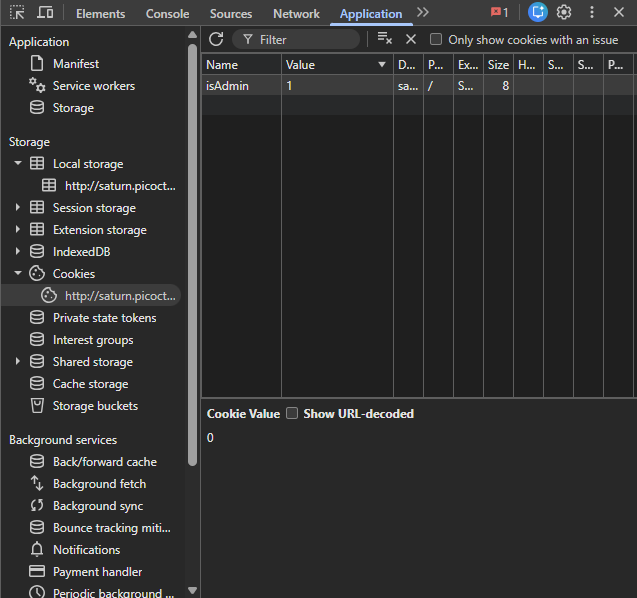
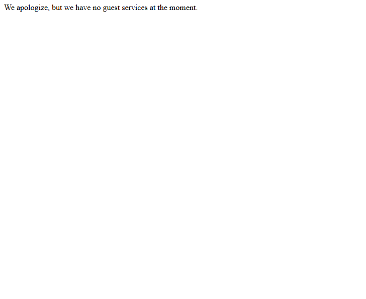

# picoCTF - Online Gradebook Cookie Manipulation Writeup

## Repository Title
**picoCTF - Online Gradebook Cookie Authentication Bypass**

## Repository Description
Professional writeup of the picoCTF Online Gradebook web exploitation challenge demonstrating client-side cookie manipulation, privilege escalation, and authentication bypass through insecure trust of user-controlled cookies.

---

## Challenge Overview

This challenge presents a simple gradebook application with a "Continue as guest" button.

After entering as a guest, the application responds with:

> We apologize, but we have no guest services at the moment.

This immediately suggests that the application is making an authorization decision based on client-side state.

---

## Objective

Gain administrative access and retrieve the flag.

---

## Initial Reconnaissance

The homepage contains a button allowing users to continue as a guest.

### Observation

The application differentiates between guest and administrator users without requiring a login form.

This is a strong indicator that a cookie may be controlling authorization.

---

## Cookie Analysis

Using Chrome DevTools:

1. Open Developer Tools (`F12`)
2. Navigate to:

Application → Storage → Cookies

A cookie named:

```text
isAdmin
```

was discovered.

Value:

```text
0
```

This suggests:

```text
0 = Guest
1 = Administrator
```

---

## Exploitation

The application trusts the client-controlled cookie.

Modify:

```text
isAdmin=0
```

to:

```text
isAdmin=1
```

Refresh the page.

The server incorrectly accepts the modified cookie and grants administrator privileges.

---

## Flag

```text
picoCTF{gr4d3_A_c00k13_65fd1e1a}
```

---

## Security Issue

### Vulnerability Class

Cookie Manipulation / Broken Access Control

### Root Cause

The application relies on a user-controlled cookie to determine authorization level.

Because the cookie is neither signed nor validated server-side, an attacker can modify its value and escalate privileges.

### Secure Design

Instead of:

```text
isAdmin=1
```

The server should:

- Store authorization information server-side
- Use signed session tokens
- Validate privileges on every request

---

## Screenshots

### Landing Page


### Cookie Modification



### Flag Retrieval



---

## Learning Outcomes

- Browser cookie inspection
- Client-side state analysis
- Authentication bypass techniques
- Broken Access Control identification
- Basic web exploitation methodology

---

## References

Several public writeups describe the same technique of changing the `isAdmin` cookie from `0` to `1` to obtain administrator access in this picoCTF challenge.
